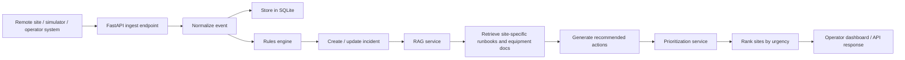

# Remote Operations Assistant for Distributed Sites

A starter project for a **multi-site SCADA / remote operations assistant**.

This project demonstrates a practical industrial-agent style flow:

1. **Operational events** arrive through a REST API.
2. Events are stored in SQLite.
3. Rules score the event urgency.
4. Site- and asset-aware retrieval (simple local RAG) finds relevant runbooks.
5. The system generates a **ranked action list** for remote operators.
6. The dashboard APIs return incidents, priorities, and shift summaries.

## What this project is and is not

This project is a **working starter implementation**.  
It is designed to be easy to run, easy to explain in an interview, and easy to expand.

It currently uses:
- **FastAPI** for APIs
- **SQLite** for storage
- **SQLAlchemy** for ORM
- **A simple TF-IDF retriever** for local RAG over runbooks
- **Rule-based scoring** for prioritization
- **A simulation script** to push fake site events

It does **not** require a cloud LLM to run.  
That keeps the project runnable on a normal laptop.

You can later upgrade it with:
- MQTT broker + Paho MQTT consumer
- a real vector database like Qdrant
- OpenAI / Ollama for natural-language action generation
- a React dashboard

---

## Project structure

```text
remote_operations_assistant/
├── app/
│   ├── api/
│   │   ├── routes_events.py
│   │   └── routes_ops.py
│   ├── services/
│   │   ├── ingestion_service.py
│   │   ├── prioritization_service.py
│   │   ├── rag_service.py
│   │   ├── rules_engine.py
│   │   └── summary_service.py
│   ├── config.py
│   ├── database.py
│   ├── main.py
│   ├── models.py
│   ├── schemas.py
│   └── seed_data.py
├── data/
│   └── runbooks/
├── scripts/
│   ├── run_smoke_test.py
│   └── simulate_events.py
├── requirements.txt
└── README.md
```

---

## Architecture

### Logical architecture



### Data flow from the first user/system input

1. A site alarm or event is sent to `POST /events`.
2. The backend validates the payload with Pydantic.
3. The event is stored in the `events` table.
4. The rules engine gives it a severity score.
5. If needed, the system creates an incident.
6. The RAG layer retrieves the most relevant runbooks using:
   - `site_id`
   - `asset_type`
   - `event_type`
7. The action generator builds an operator-friendly action list.
8. The prioritization service ranks the active incidents across sites.
9. Remote operators call:
   - `GET /ops/ranked-actions`
   - `GET /ops/shift-summary`
   - `GET /ops/incidents`

### Input types supported

#### Main input
Operational JSON events through REST API.

#### Optional future input
MQTT topic events from distributed sites.

#### Operator input
Natural-language style queries can later be added, but in this starter project the main operator interaction is through REST endpoints.

---

## How to run

### 1. Create and activate a virtual environment

#### Windows PowerShell
```powershell
python -m venv .venv
.\.venv\Scripts\Activate.ps1
```

#### Windows CMD
```cmd
python -m venv .venv
.venv\Scripts\activate.bat
```

#### Linux / macOS
```bash
python -m venv .venv
source .venv/bin/activate
```

### 2. Install dependencies
```bash
pip install -r requirements.txt
```

### 3. Start the API
```bash
uvicorn app.main:app --reload
```

The API docs will be available at:
- `http://127.0.0.1:8000/docs`

### 4. Simulate sample industrial events
In another terminal:
```bash
python scripts/simulate_events.py
```

### 5. Check the ranked action list
Open:
- `http://127.0.0.1:8000/ops/ranked-actions`
- `http://127.0.0.1:8000/ops/shift-summary`
- `http://127.0.0.1:8000/ops/incidents`

---

## Smoke test

You can run a quick local test without starting Uvicorn:

```bash
python scripts/run_smoke_test.py
```

This will:
- initialize the DB
- seed runbooks
- send sample events
- print incidents and ranked actions

---

## Example event input

```json
{
  "site_id": "water_north",
  "site_name": "North Water Plant",
  "asset_id": "pump_07",
  "asset_type": "pump",
  "event_type": "pressure_alarm",
  "severity": "high",
  "topic": "water_north/pump_07/pressure_alarm",
  "message": "Pressure exceeded upper threshold for 2 minutes",
  "value": 142.8
}
```

---

## Main API routes

### Health
- `GET /`

### Event ingestion
- `POST /events`
- `GET /events`

### Operations output
- `GET /ops/incidents`
- `GET /ops/ranked-actions`
- `GET /ops/shift-summary`

---

## How the project can be improved

1. Add a real MQTT broker and background consumer.
2. Add Qdrant and embeddings for better RAG.
3. Add OpenAI or Ollama to rewrite the action list in a more natural way.
4. Add auth, audit trails, and approval workflow.
5. Add trend metrics like:
   - incident count per site
   - mean time to detect
   - unresolved incident age
   - site risk score over time

---

## Notes

- This project is intentionally simple and heavily commented so you can explain it clearly.
- It is a strong **starter architecture** for a larger industrial agent system.
